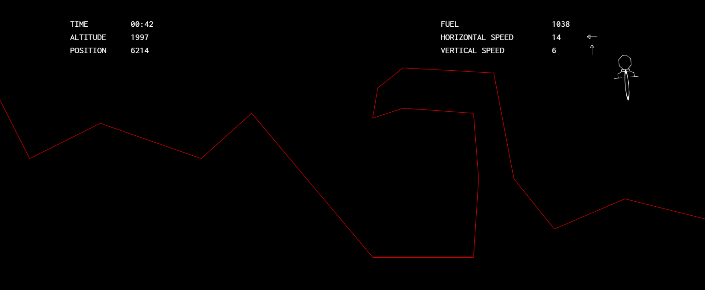

This repo features a genetic algorithm I built in Python 3 to solve the [Mars Lander](https://www.codingame.com/ide/puzzle/mars-lander-episode-3) puzzle on the website CodinGame.

In this puzzle, one must write a program to pilot a ship and land it safely on Mars. The program has to control the ship's angle and thrust, fly it to the flat landing site without colliding with Mars' surface, and ensure that the landing speed is sufficiently low. Also, the program is only given 100ms per turn to output its desired angle and thrust changes.

A video replay of the program in action: https://www.codingame.com/replay/594318475

## The Power of Evolution
The genetic algorithm initially generates random sequences of angle and thrust changes and simulates them to determine how well they do. Then it allows the better scoring ones to "reproduce" and create a fitter generation. By repeating this process many times, the program can eventually find a safe path to the landing site on its own without any hardcoding of the path and required angle and thrust changes.

## More Details
Each chromosome in a population represents a sequence of possible moves for a ship. Each gene on the chromosome represents a single pair of desired angle and thrust changes for a turn. The fitness for each chromosome is found by simulating the physics of the puzzle and seeing where the ship ends up. The fitness score is based on several factors like how long the ship survives, how close to the landing site it crashes and its speed when landing on the landing site.

Subsequent populations carry over a portion of the best chromosomes from the previous population. Then, the remaining children are generated by using fitness proportionate selection to choose a pair of chromosomes and one-point crossover to produce a pair of children. Every child created in a crossover also has a chance of having one of its genes replaced with a random gene.